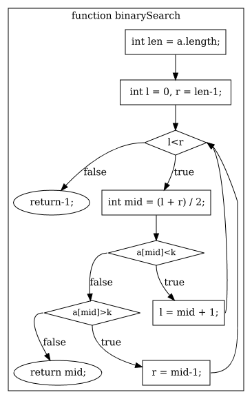

# CodeFlow API

[](https://jitpack.io/#LeeReindeer/codeflow-core)

Let's convert Java code to flowchart graph!

## Features

Java code to flowchart graph:

- [x] Control flow in Java: sequence, loop(`for`, `while`, `do while`) and condition(`if`)
- [ ] Support `switch` statement
- [ ] Support `break`, `contuine` and labels
- [x] Top-level function and statement
- [x] Multi-function supported, which represented in subgraphs
- [x] Function overload(different arguments size only)
- [x] Semantic check and warning
- [ ] Support Class method

## Quick start

```java
CodeFlow codeFlow = CodeFlow.builder()
              .outDir("tests")
              .format(Format.PNG)
              .build();
codeFlow.parse("if(ok){doSome();}else{doSomeElse();}").toFile("file.png");
```

## Usage

1. Add dependency

Maven:

```
<repositories>
    <repository>
        <id>jitpack.io</id>
		<url>https://jitpack.io</url>
    </repository>
</repositories>
```

```xml
<dependency>
    <groupId>com.github.LeeReindeer</groupId>
    <artifactId>codeflow-core</artifactId>
    <version>${latest-version}</version>
</dependency>
```

Gradle:

```
allprojects {
    repositories {
        ...
	    maven { url 'https://jitpack.io' }
	}
}
```

```
implementation 'com.github.LeeReindeer:codeflow-core:${latest-version}'
```

For snapshot, use `master-SNAPSHOT` as the version tag.

2. Get a builder

```java
CodeFlow codeFlow = CodeFlow.builder()
        .supportClass(false)        // whether support class declare
        .functionColor("lightblue") // node color for function call
        .workDir("examples")        // input file dir
        .outDir("tests")            // output file dir
        .format(Format.PNG)         // output file format
        .build();
```

3. Do Convert

-  `parse(String code)`

- `parse(Supplier<String> supplier)`

- `parse(File file)`

- `parseFile(String path)`

Examples:

```java
// convert code string to java.awt.image.BufferedImage
codeFlow.parse("if(ok){doSome();}else{doSomeElse();}").toImage();
// convert code in file simple.cf to simple.png
codeFlow.parseFile("simple.cf").toFile("simple.png");
```

## Examples

```java
int binarySearch(int[] a, int k) {
    int len = a.length;
    int l = 0, r = len - 1;
    while (l < r) {
      int mid = (l + r) / 2;
      if (a[mid] < k) {
        l = mid + 1;
      }
      else if (a[mid] > k) {
        r = mid - 1;
      } else {
        return mid;
      }
    }
    return rst();
}

int rst() {
  return -1;
}
```

Above code will generate a flowchart like:



See more example at [examples folder](examples/).

## How it works

- It use [ANTLR4](https://www.antlr.org/) to generate parser to parse Java code. 

- And then, visit the AST to build flowchart fragment:
    - The single flowchart fragment is built directly
    - The complex flowchart fragment(like nested conditions and loops) is built recursively

- Use [graphviz-java](https://github.com/nidi3/graphviz-java) library convert node data structure to [dot](https://en.wikipedia.org/wiki/DOT_\(graph_description_language\)) file.

- Finally, use [Graphviz](https://www.graphviz.org/) to convert dot file to graph image.